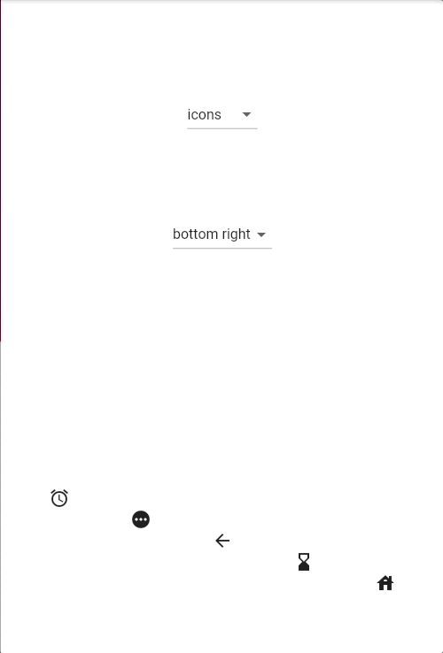
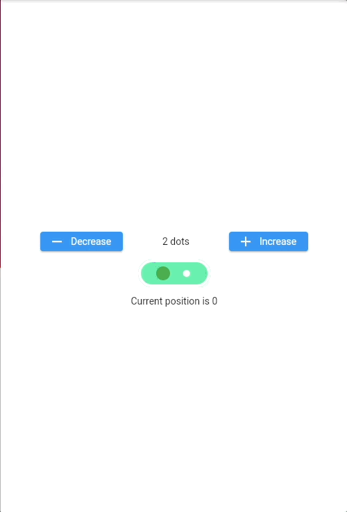
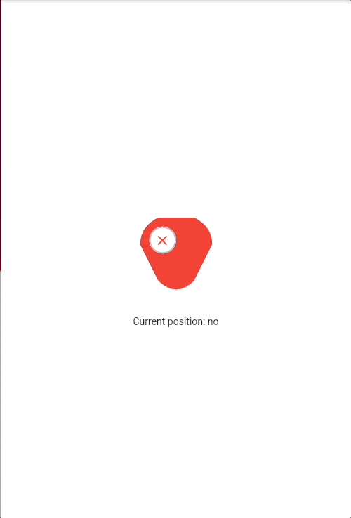
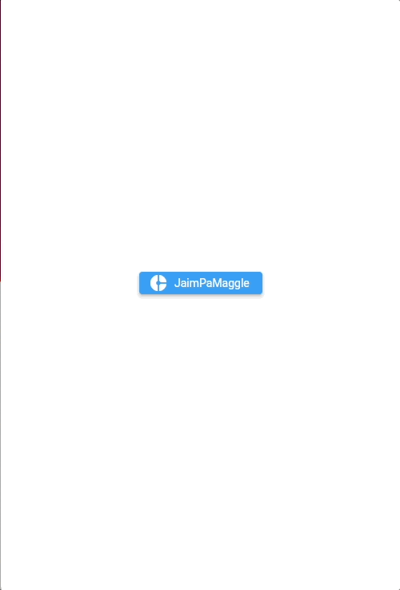
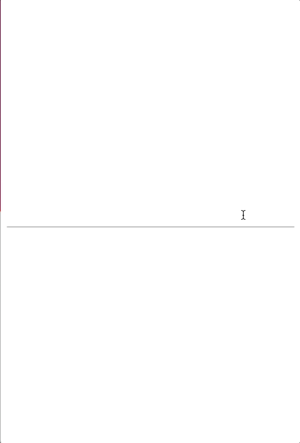
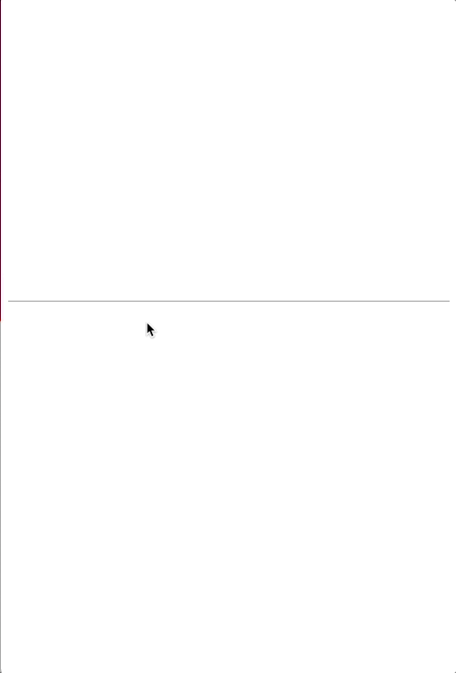
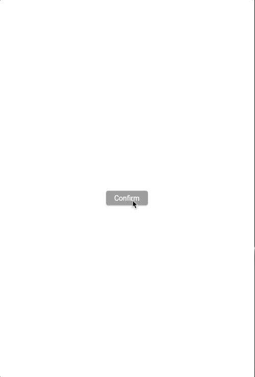

# weirdgets
XPEHO Mobile weird Flutter widgets library

# Summary

[Available weirdgets](#available-weirdgets)
    
* [Diagonal](#diagonal)
* [Multiggle](#multiggle)
* [Troggle](#troggle)
* [JaimPaMaggle](#jaimpamaggle)
* [RevertedTextField](#revertedtextfield)
* [UpsideDownTextField](#upsidedowntextfield)
* [RadioButton](#radiobutton)
* [ValidationsButton](#validationsbutton)
* [FirstAprilFish](#firstaprilfish)

# Available weirdgets

## Diagonal

Borred to always organize your widgets with rows and columns ?

Try the Diagonal ! A new funny way to show a widget list.



```dart
@override
Widget build(BuildContext context) {
    return Diagonal(
        children: [
            ...
        ],
        // Choose between 4 directions (bottomRight, bottomLeft, topLeft, topRight)
        direction: DiagonalDirection.bottomRight,
    );
}
```

## Multiggle

2 positions are not enought ? Good news ! We made a weirdget for you.

Try the Multiggle, a toggle but with more than 2 positions.



```dart
class MyWidget extends StatelessWidget {

    // Create a controller if you want to... control your Multiggle
    final MultiggleController _multiggleController = MultiggleController();

...

    @override
    Widget build(BuildContext context) {
        return Multiggle(
            // add the controller here
            controller: _multiggleController,
            // specify how much position your Multiggle should provide
            count: 42,
            // 0 is the first position
            initialPosition: 0,
            // position changed callback
            onPositionChanged: (position) {
                // 
            },
            // Theming colors
            backgroundColor: Colors.greenAccent,
            borderColor: Colors.white,
            indicatorColor: Colors.green,
        );
    }

    ...

    _changePosition(int newPosition) {
        // Setup position from code
        _multiggleController.setPosition(newPosition);
    }

}

```

## Troggle

Sometimes we would like to say maybe instead of yes or no. That's why we created the Troggle.

The Troggle is a Toggle with a third position. Then, you can choose between, 'yes', 'no' and 'maybe'. Feel free to tell that you're not decided !



```dart
@override
Widget build(BuildContext context) {
    return Troggle(
        width: 42,
        height: 42,
        quarterTurns: 1,
        onPositionChanged: (trogglePosition) {
            // yes, no, maybe
        },
    );
}
```

## JaimPaMaggle

Tired of posing ? Just add this widget and... snap !

Oh ! A picture appears... Enjoy your better selfie ! I guess.. or not...



```dart
@override
Widget build(BuildContext context) {
    return JaimPaMaggle(
        label: 'Cheeeeeese',
        // If your device has multiple cameras
        showCameraSelection: true,
    );
}
```

## RevertedTextField

Accessibility is a real concern. That's why we made the RevertedTextField for everyone who writes from right to left. Because you should be able to create Flutter apps too, even if you use the alphabet with a mirror glass.



```dart
@override
Widget build(BuildContext context) {
    return RevertedTexfield();
}
```

## UpsideDownTextField

Again, we want everyone can use Flutter. So we also thought about our developper friends who works upside down in the south hemisphere. We made the UpsideDownTextField for you ! You will now be able to write text without neck pain or torticollis



```dart
@override
Widget build(BuildContext context) {
    return UpsideDownTexfield();
}
```

## RadioButton

Good news Flutter community ! We finally fixed the RadioButton widget. Since the beginning of the Flutter SDK publication, the RadioButton was not working well... Because it was not playing any radio. What a pity...

That's now fixed !

```dart
@override
Widget build(BuildContext context) {
    return RadioButton(
        radios: {
        "MyFMradio": "http://radioURL",
        "MyAMradio": "https://radioURL",
        "MyOtherRadio": "http://radioURL",
    };
}
```

## ValidationsButton

Afraid about the miss click ? Use the ValidationsButton !
This widget provides you a way to have multiple confirmations to prevent from a choice that user is not really making



```dart
@override
Widget build(BuildContext context) {
    return ValidationsButton(
        validationMessages: const [
            "Confirm",
            "Is it a miss click ?",
            "Are you sure ?",
            "You should think about it again",
            "No, please don't do it",
            "ok, but maybe you should think about it again",
            "If you confirm, cancel will not be available",
            "Once again",
            "So close",
            "Last chance !",
        ],
        onValidation: () {
                // We a sure that the user is... sure and confirm his choice
            }
        ),
    );
}
```

## FirstAprilFish

April fool ! As some clue could suggest, this whole library is a joke for sure. But we've created a last weirdget if you want to take a picture with the april fish on it. Enjoy !

```dart
@override
Widget build(BuildContext context) {
    return FirstAprilFish(
        label: 'FirstAprilFish',
        showCameraSelection: true,
    );
}
```

# Requirements

## iOS & macOS security requirements

By default you can't load http urls on iOS and macOS. To avoid this restriction you must edit your .plist and add:

```xml
<key>NSAppTransportSecurity</key>
<dict>
    <key>NSAllowsArbitraryLoads</key>
    <true/>
</dict>
```

## macOS outgoing connections 

By default, Flutter macOS apps don't allow outgoing connections, so you can't play audio streams from the internet.
To avoid this problem, add these lines to the .entitlements files of your macOS app

```xml
<key>com.apple.security.network.client</key>
<true/>
```

## Android security requirements

By default, you can't load http urls on android. To avoid this restriction you must add these lines to the AndroidManifest.xml file located in android/app/src/main/AndroidManifest.xml

```xml
<uses-permission android:name="android.permission.INTERNET" />
<application
    android:usesCleartextTraffic="true">
</application>
```
